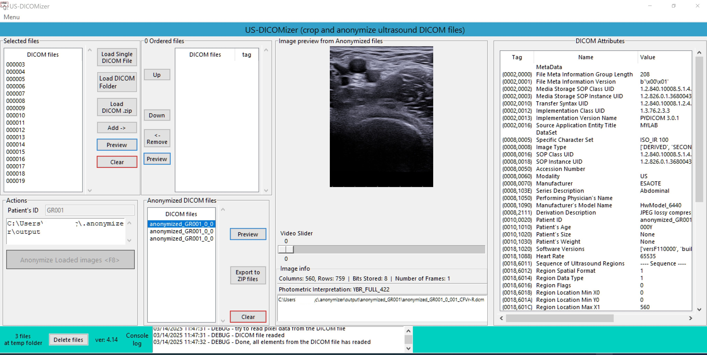

# US-DICOMizer
US-DICOMizer is an advanced application designed to automate and streamline the preparation of ultrasound diagnostic DICOM files for AI-based workflows. The application incorporates three key functionalities: 

1. **anonymisation** to remove sensitive patient information while preserving essential metadata for AI tasks, 
2. **cropping** to extract relevant regions from images or videos, and 
3. **tagging** to annotate files with critical metadata, such as anatomical position, imaging purpose, and other contextual information. 

These functionalities aim to address the unique requirements of ultrasound imaging data preparation while ensuring compliance with data privacy regulations and clinical standards.



## Changelog
### Changes in version 4.16
Added auto detection for cropping  
Minor changes at logs output  

### Changes in version 4.15
Bug fix in load_tags()  
All DICOM attributes load instantly  
Change title in the 1st header of the treeview to Group,Element  

Bug fix when convert_all_to_jpeg == "yes"  
New compressed JPEG file save with the rigth Transfer Syntax JPEG Baseline (Process 1)  
and Photometric Interpretation YBR_FULL_422  

Change the timestamp date - time format  
from  d-m-y HH:MM:SS 12h format  
to    y-m-d HH:MM:SS 24h format  
### Changes in version 4.14  
Patient's ID not delete but define as the filename  
The values for X0, Y0, X1, Y1 not delete but update them  
Add the About window  
Removed the free text area
### Changes in version 4.13  
If in [settings] section at settings.ini file  
user_can_change_compression_level = no  
then at settings window the jpeg quality text entry is disabled  

Added the free text area at the footer  
Minor updates at footer section  
### Changes in version 4.12  
Smaller font size in treeviews  
Separation of attributes into metadata and dataset  
Added ability to copy values ​​from treeview with attribute tags by right-click  
Added options (title) to filedialog  
Removed simpleTK and scikit-image modules as they are no longer used  

## Citation

If you use US-DICOMizer in a scientific publication, we would appreciate using the following citation:

* *Pechlivanis, D., Didaskalou, S., Kaldoudi, E. and Drosatos, G. (2025). Preparing Ultrasound Imaging Data for Artificial Intelligence Tasks: Anonymisation, Cropping, and Tagging. In Proceedings of the 18th International Joint Conference on Biomedical Engineering Systems and Technologies (BIOSTEC 2025) - Volume 2: HEALTHINF, ISBN 978-989-758-731-3, ISSN 2184-4305, pages 951-958. DOI: [10.5220/0013379400003911](https://doi.org/10.5220/0013379400003911)*

and as BibTeX:
```
@incollection{Pechlivanis_US-DICOMizer_2025,
    author       = {Pechlivanis, Dimitrios and Didaskalou, Stylianos and Kaldoudi, Eleni and Drosatos, George},
    title        = {Preparing Ultrasound Imaging Data for Artificial Intelligence Tasks: Anonymisation, Cropping, and Tagging},
    keywords     = {Ultrasound Imaging;DICOM;Anonymisation;Cropping;Tagging;Artificial Intelligence (AI)},
    booktitle    = {Proceedings of the 18th International Joint Conference on Biomedical Engineering Systems and Technologies (BIOSTEC 2025) - Volume 2: HEALTHINF},
    volume       = {2},
    year         = {2025},
    pages        = {951-958},
    publisher    = {SciTePress},
    organization = {INSTICC},
    doi          = {10.5220/0013379400003911},
    isbn         = {978-989-758-731-3},
    issn         = {2184-4305}
}
```
